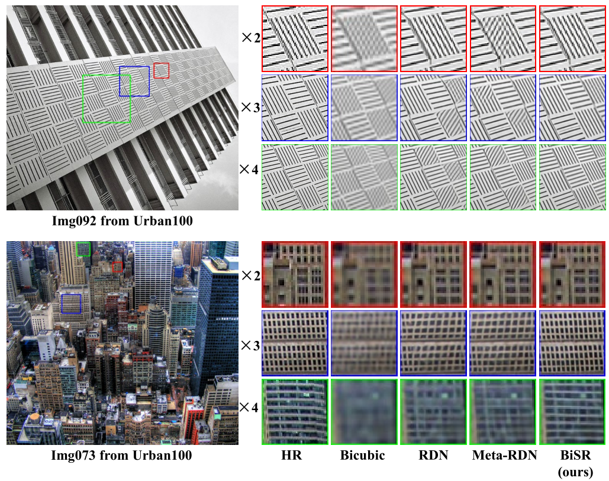

# BiSR
Official implementation of **Bilateral Upsampling Network for Single Image Super-Resolution with Arbitrary Scaling Factors(PyTorch)**

Our code is built on [EDSR(PyTorch)](https://github.com/thstkdgus35/EDSR-PyTorch) and [Mata-SR](https://github.com/XuecaiHu/Meta-SR-Pytorch).



# Requirements

* Pytorch 1.5.0
* Python 3.7
* numpy
* skimage
* imageio
* cv2  

# Install and run demo
1. download the code
```
git clone https://github.com/Merle314/BiSR
cd BiSR/src
```


2. run training demo:
```
python3 main.py --save RBiRDN_BI --model RBiRDN --epochs 2000 --batch_size 16 --patch_size 50 --save_models --save_results --reset --ext sep --GPU_ids 0,1,2,3 --pre_train ../pretrain/RBiRDN_BI/model/model_latest.pt 

```

3. run test demo:
* download the model from the [BaiduYun](https://pan.baidu.com/s/1-V7aYxl2OJ5r-S-hGc993Q) fetch code: p70u

```
python3 main.py --model RBiCARN --ext img --save RBiCARN_BI_Test_Urban100 --GPU_ids 0 --batch_size 1 --test_only --data_test Urban100 --pre_train ../pretrain/BiCARN_BI/model/model_latest.pt --save_results
```

# Train and Test as our paper

1.  prepare  dataset
   * download the dataset [DIV2K](http://data.vision.ee.ethz.ch/cvl/DIV2K/DIV2K_train_HR.zip) and [test dataset](https://pan.baidu.com/s/1tzJFzEN5QdN53CcE1DheHw) fetch code: ev7u [GoogleDrive](https://drive.google.com/open?id=14BW1q3_i6FRoq7PwwQ-81GbXWph6934x)
   *  change the path_src = DIV2K HR image folder path and run /prepare_dataset/generate_LR_metasr_X1_X4_idealboy.m 
   *  upload the dataset 
   * change the  dir_data in option.py： dir_data = "/path to your DIV2K and testing dataset'(keep the training and test dataset in the same folder: test dataset under the benchmark folder and training dataset rename to DIV2K, or change the data_train to your folder name)  
2. pre_train model  for test
  [BaiduYun](https://pan.baidu.com/s/1-V7aYxl2OJ5r-S-hGc993Q) fetch code: p70u  
  [GoogleDrive](https://drive.google.com/drive/folders/1I3Gzttb9bh9lI7abo05rZ4XEn50-zGog?usp=sharing)
  
## train 
```
cd BiSR/src 
python3 main.py --save RBiRDN_BI --model RBiRDN --epochs 2000 --batch_size 16 --patch_size 50 --save_models --save_results --reset --ext sep --GPU_ids 0,1,2,3 --pre_train ../pretrain/RBiRDN_BI/model/model_latest.pt 
```
## test 
```
python3 main.py --model RBiCARN --ext img --save RBiCARN_BI_Test_Urban100 --GPU_ids 0 --batch_size 1 --test_only --data_test Urban100 --pre_train ../pretrain/BiCARN_BI/model/model_latest.pt --save_results
```
# Citation
```
